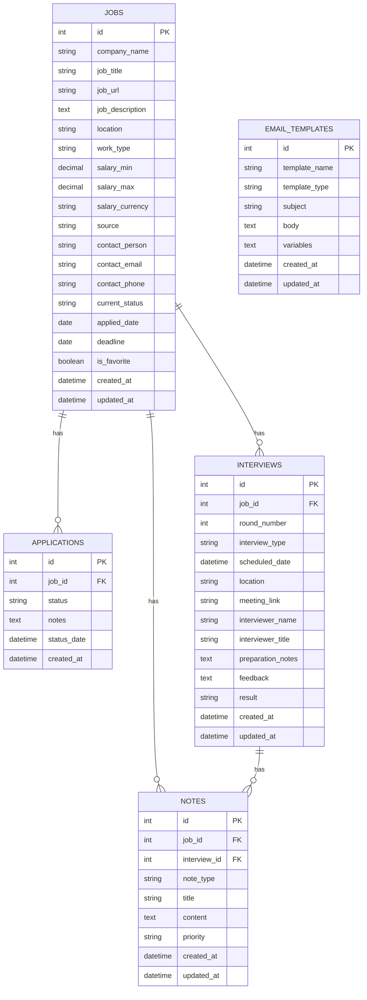

# Job Tracker Database Design

## ERD Diagram (Mermaid)



## Chi tiết các bảng

### 1. JOBS - Bảng công việc ứng tuyển

Lưu trữ thông tin về các công việc mà ứng viên đã/đang ứng tuyển.

| Cột | Kiểu dữ liệu | Mô tả | Ràng buộc |
|-----|-------------|-------|-----------|
| id | INTEGER | ID duy nhất của job | PRIMARY KEY, AUTO_INCREMENT |
| company_name | VARCHAR(255) | Tên công ty | NOT NULL |
| job_title | VARCHAR(255) | Tên vị trí ứng tuyển | NOT NULL |
| job_url | TEXT | Link bài đăng tuyển dụng | |
| job_description | TEXT | Mô tả công việc | |
| location | VARCHAR(255) | Địa điểm làm việc | |
| work_type | VARCHAR(50) | Hình thức (Remote/Hybrid/Onsite) | |
| salary_min | DECIMAL(12,2) | Mức lương tối thiểu | |
| salary_max | DECIMAL(12,2) | Mức lương tối đa | |
| salary_currency | VARCHAR(10) | Đơn vị tiền tệ (VND/USD...) | DEFAULT 'VND' |
| source | VARCHAR(100) | Nguồn tuyển dụng (LinkedIn, TopCV...) | |
| contact_person | VARCHAR(255) | Tên người liên hệ/HR | |
| contact_email | VARCHAR(255) | Email liên hệ | |
| contact_phone | VARCHAR(20) | Số điện thoại liên hệ | |
| current_status | VARCHAR(50) | Trạng thái hiện tại | NOT NULL, DEFAULT 'Applied' |
| applied_date | DATE | Ngày nộp hồ sơ | NOT NULL |
| deadline | DATE | Hạn nộp hồ sơ | |
| is_favorite | BOOLEAN | Đánh dấu yêu thích | DEFAULT FALSE |
| created_at | DATETIME | Thời gian tạo | DEFAULT CURRENT_TIMESTAMP |
| updated_at | DATETIME | Thời gian cập nhật | DEFAULT CURRENT_TIMESTAMP ON UPDATE |

**Các giá trị status hợp lệ**: 
- Applied (Đã nộp hồ sơ)
- Screening (Đang xét duyệt hồ sơ)
- Interview (Đang phỏng vấn)
- Offer (Nhận offer)
- Hired (Được tuyển)
- Rejected (Bị từ chối)
- Withdrawn (Rút hồ sơ)

**Indexes**:
- PRIMARY KEY (id)
- INDEX idx_company_name (company_name)
- INDEX idx_status (current_status)
- INDEX idx_applied_date (applied_date)
- INDEX idx_source (source)

---

### 2. APPLICATIONS - Bảng lịch sử trạng thái

Lưu lịch sử chuyển đổi trạng thái của từng job trong pipeline.

| Cột | Kiểu dữ liệu | Mô tả | Ràng buộc |
|-----|-------------|-------|-----------|
| id | INTEGER | ID duy nhất | PRIMARY KEY, AUTO_INCREMENT |
| job_id | INTEGER | ID job tham chiếu | FOREIGN KEY → jobs(id), NOT NULL |
| status | VARCHAR(50) | Trạng thái mới | NOT NULL |
| notes | TEXT | Ghi chú về lần chuyển trạng thái | |
| status_date | DATETIME | Thời điểm chuyển trạng thái | NOT NULL |
| created_at | DATETIME | Thời gian tạo record | DEFAULT CURRENT_TIMESTAMP |

**Mục đích**: 
- Theo dõi timeline của từng job
- Phân tích thời gian trung bình ở mỗi stage
- Audit trail cho các thay đổi

**Indexes**:
- PRIMARY KEY (id)
- FOREIGN KEY (job_id) REFERENCES jobs(id) ON DELETE CASCADE
- INDEX idx_job_status (job_id, status)
- INDEX idx_status_date (status_date)

---

### 3. INTERVIEWS - Bảng lịch phỏng vấn

Lưu thông tin chi tiết về các buổi phỏng vấn.

| Cột | Kiểu dữ liệu | Mô tả | Ràng buộc |
|-----|-------------|-------|-----------|
| id | INTEGER | ID duy nhất | PRIMARY KEY, AUTO_INCREMENT |
| job_id | INTEGER | ID job tham chiếu | FOREIGN KEY → jobs(id), NOT NULL |
| round_number | INTEGER | Vòng phỏng vấn (1, 2, 3...) | NOT NULL |
| interview_type | VARCHAR(50) | Loại PV (Phone/Video/Onsite/Technical) | |
| scheduled_date | DATETIME | Ngày giờ phỏng vấn | NOT NULL |
| location | VARCHAR(255) | Địa điểm (nếu onsite) | |
| meeting_link | TEXT | Link meeting (nếu online) | |
| interviewer_name | VARCHAR(255) | Tên người phỏng vấn | |
| interviewer_title | VARCHAR(255) | Chức danh người phỏng vấn | |
| preparation_notes | TEXT | Ghi chú chuẩn bị | |
| feedback | TEXT | Feedback sau phỏng vấn | |
| result | VARCHAR(50) | Kết quả (Passed/Failed/Pending) | |
| created_at | DATETIME | Thời gian tạo | DEFAULT CURRENT_TIMESTAMP |
| updated_at | DATETIME | Thời gian cập nhật | DEFAULT CURRENT_TIMESTAMP ON UPDATE |

**Các giá trị interview_type**:
- Phone Screening
- Video Call
- Technical Test
- Onsite Interview
- Final Round
- HR Interview

**Indexes**:
- PRIMARY KEY (id)
- FOREIGN KEY (job_id) REFERENCES jobs(id) ON DELETE CASCADE
- INDEX idx_job_date (job_id, scheduled_date)
- INDEX idx_scheduled_date (scheduled_date)

---

### 4. NOTES - Bảng ghi chú

Lưu ghi chú tổng quan về job hoặc ghi chú chi tiết cho từng buổi phỏng vấn.

| Cột | Kiểu dữ liệu | Mô tả | Ràng buộc |
|-----|-------------|-------|-----------|
| id | INTEGER | ID duy nhất | PRIMARY KEY, AUTO_INCREMENT |
| job_id | INTEGER | ID job (nếu là note chung) | FOREIGN KEY → jobs(id), NULLABLE |
| interview_id | INTEGER | ID interview (nếu là note PV) | FOREIGN KEY → interviews(id), NULLABLE |
| note_type | VARCHAR(50) | Loại ghi chú | NOT NULL |
| title | VARCHAR(255) | Tiêu đề ghi chú | |
| content | TEXT | Nội dung ghi chú | NOT NULL |
| priority | VARCHAR(20) | Độ ưu tiên (Low/Medium/High) | DEFAULT 'Medium' |
| created_at | DATETIME | Thời gian tạo | DEFAULT CURRENT_TIMESTAMP |
| updated_at | DATETIME | Thời gian cập nhật | DEFAULT CURRENT_TIMESTAMP ON UPDATE |

**Ràng buộc logic**: Ít nhất một trong `job_id` hoặc `interview_id` phải có giá trị (CHECK constraint)

**Các giá trị note_type**:
- General (Ghi chú chung)
- Research (Nghiên cứu công ty)
- Preparation (Chuẩn bị)
- Interview_Feedback (Feedback PV)
- Follow_Up (Follow-up)
- Reminder (Nhắc nhở)

**Indexes**:
- PRIMARY KEY (id)
- FOREIGN KEY (job_id) REFERENCES jobs(id) ON DELETE CASCADE
- FOREIGN KEY (interview_id) REFERENCES interviews(id) ON DELETE CASCADE
- INDEX idx_job_notes (job_id)
- INDEX idx_interview_notes (interview_id)
- INDEX idx_note_type (note_type)

---

### 5. EMAIL_TEMPLATES - Bảng mẫu email

Lưu các template email để gửi follow-up, thank you, withdraw...

| Cột | Kiểu dữ liệu | Mô tả | Ràng buộc |
|-----|-------------|-------|-----------|
| id | INTEGER | ID duy nhất | PRIMARY KEY, AUTO_INCREMENT |
| template_name | VARCHAR(255) | Tên template | NOT NULL, UNIQUE |
| template_type | VARCHAR(50) | Loại template | NOT NULL |
| subject | VARCHAR(500) | Tiêu đề email | NOT NULL |
| body | TEXT | Nội dung email | NOT NULL |
| variables | TEXT | Các biến có thể dùng (JSON) | |
| created_at | DATETIME | Thời gian tạo | DEFAULT CURRENT_TIMESTAMP |
| updated_at | DATETIME | Thời gian cập nhật | DEFAULT CURRENT_TIMESTAMP ON UPDATE |

**Các giá trị template_type**:
- Thank_You (Cảm ơn sau PV)
- Follow_Up (Follow-up sau khi apply/PV)
- Withdraw (Rút hồ sơ)
- Accept_Offer (Chấp nhận offer)
- Decline_Offer (Từ chối offer)
- Request_Info (Yêu cầu thông tin)

**Variables** (JSON format):
```json
{
  "company_name": "Tên công ty",
  "job_title": "Vị trí ứng tuyển",
  "interviewer_name": "Tên người phỏng vấn",
  "interview_date": "Ngày phỏng vấn",
  "candidate_name": "Tên ứng viên"
}
```

**Indexes**:
- PRIMARY KEY (id)
- UNIQUE INDEX idx_template_name (template_name)
- INDEX idx_template_type (template_type)

---

## Quan hệ giữa các bảng

### 1. JOBS ↔ APPLICATIONS (1:N)
- Mỗi job có nhiều lần chuyển trạng thái
- ON DELETE CASCADE: Xóa job sẽ xóa toàn bộ lịch sử

### 2. JOBS ↔ INTERVIEWS (1:N)
- Mỗi job có nhiều buổi phỏng vấn (nhiều vòng)
- ON DELETE CASCADE: Xóa job sẽ xóa lịch phỏng vấn

### 3. JOBS ↔ NOTES (1:N)
- Mỗi job có nhiều ghi chú chung
- ON DELETE CASCADE: Xóa job sẽ xóa ghi chú

### 4. INTERVIEWS ↔ NOTES (1:N)
- Mỗi buổi PV có nhiều ghi chú riêng
- ON DELETE CASCADE: Xóa interview sẽ xóa ghi chú

### 5. EMAIL_TEMPLATES (Độc lập)
- Không có FK, dùng chung cho toàn hệ thống
- Có thể reference trong notes hoặc ứng dụng

---

## Các query phổ biến được tối ưu

### 1. Tìm kiếm/Lọc đa tiêu chí
```sql
SELECT * FROM jobs 
WHERE company_name LIKE '%keyword%' 
  AND current_status = 'Interview'
  AND source = 'LinkedIn'
  AND applied_date BETWEEN '2025-01-01' AND '2025-12-31'
ORDER BY applied_date DESC;
```

### 2. Báo cáo theo trạng thái
```sql
SELECT current_status, COUNT(*) as count 
FROM jobs 
GROUP BY current_status;
```

### 3. Báo cáo theo nguồn
```sql
SELECT source, COUNT(*) as total_applications,
       SUM(CASE WHEN current_status = 'Hired' THEN 1 ELSE 0 END) as hired_count
FROM jobs 
GROUP BY source;
```

### 4. Lịch phỏng vấn sắp tới
```sql
SELECT j.company_name, j.job_title, i.* 
FROM interviews i
JOIN jobs j ON i.job_id = j.id
WHERE i.scheduled_date >= NOW()
ORDER BY i.scheduled_date ASC;
```

### 5. Timeline của 1 job
```sql
SELECT a.status, a.status_date, a.notes
FROM applications a
WHERE a.job_id = ?
ORDER BY a.status_date ASC;
```

---

## Lưu ý thiết kế

### 1. **Tính mở rộng**
- Có thể thêm bảng `COMPANIES` để tránh trùng lặp tên công ty
- Có thể thêm bảng `DOCUMENTS` để lưu CV, cover letter theo từng job
- Có thể thêm bảng `REMINDERS` cho chức năng nhắc nhở

### 2. **Tính toàn vẹn**
- Foreign key với ON DELETE CASCADE đảm bảo không có orphan records
- CHECK constraints cho các enum values
- NOT NULL cho các trường bắt buộc

### 3. **Performance**
- Indexes trên các cột hay query (status, date, company_name)
- Composite index cho các query phức tạp
- Có thể partitioning theo năm nếu dữ liệu lớn

### 4. **Security**
- Nếu triển khai multi-user, cần thêm `user_id` vào bảng JOBS
- Encryption cho dữ liệu nhạy cảm (contact info)

### 5. **Audit Trail**
- `created_at`, `updated_at` ở mọi bảng chính
- Bảng APPLICATIONS lưu đầy đủ lịch sử thay đổi

---

## Kết luận

Thiết kế CSDL này:
- ✅ **Đầy đủ**: Cover toàn bộ yêu cầu chức năng
- ✅ **Chuẩn hóa**: Đạt 3NF, tránh redundancy
- ✅ **Linh hoạt**: Dễ mở rộng thêm tính năng
- ✅ **Tối ưu**: Indexes hợp lý cho các query thường dùng
- ✅ **Toàn vẹn**: Foreign keys, constraints đảm bảo data integrity

Thiết kế phù hợp cho một ứng viên cá nhân quản lý job applications, có thể scale lên multi-user nếu cần.
